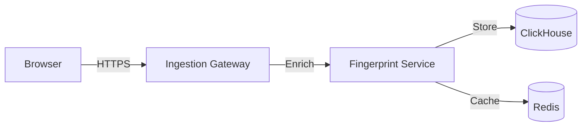

# RFC & Documentation Standards

**Activation**: Glob pattern `docs/**/*.md`, `*.md`

## RFC Structure

### Standard Template
```markdown
# RFC-XXXX: [Title]

**Status**: [Draft | Review | Accepted | Implemented | Deprecated]  
**Author**: [Name]  
**Created**: YYYY-MM-DD  
**Updated**: YYYY-MM-DD

## Summary

[One-paragraph executive summary]

## Motivation

[Why is this change necessary? What problem does it solve?]

## Proposal

[Detailed description of the proposed change]

### Technical Design

[Architecture diagrams, data structures, algorithms]

### API Design

[Public interfaces, request/response formats]

### Performance Considerations

[Expected impact on latency, throughput, memory]

### Security Considerations

[Threat model, mitigations, privacy implications]

## Alternatives Considered

[Other approaches and why they were rejected]

## Implementation Plan

### Phase 1: [Name]
- [ ] Task 1
- [ ] Task 2

### Phase 2: [Name]
- [ ] Task 3
- [ ] Task 4

## Testing Strategy

[How will this be tested? What edge cases must be covered?]

## Rollout Plan

[How will this be deployed? Canary? Feature flags?]

## Success Metrics

[How will we measure success?]

## Open Questions

- [ ] Question 1
- [ ] Question 2

## References

- [Related RFCs]
- [External documentation]
- [Research papers]
```

## Documentation Types

### 1. RFCs (Request for Comments)
**Purpose**: Design documents for major features or architectural changes

**When to create**:
- New system components
- Breaking API changes
- Performance optimizations
- Security enhancements

**Review process**:
1. Create draft RFC in `docs/rfcs/`
2. Share with team for review
3. Address feedback and update
4. Mark as "Accepted" when approved
5. Mark as "Implemented" when complete

### 2. Architecture Docs
**Purpose**: Explain system design and component interactions

**Required sections**:
- System overview diagram
- Component responsibilities
- Data flow diagrams
- Technology stack justification
- Scalability considerations

### 3. API Documentation
**Purpose**: Complete reference for all public APIs

**Format**:
```markdown
## POST /v1/ingest

Ingest browser telemetry data and create/update session.

### Request

**Headers**:
- `Content-Type: application/json`
- `X-Scrybe-Timestamp: <unix_timestamp_ms>`
- `X-Scrybe-Nonce: <uuid>`
- `X-Scrybe-Signature: <hmac_sha256_hex>`

**Body**:
```json
{
  "user_agent": "string",
  "screen_width": number,
  "screen_height": number,
  "canvas_fingerprint": "string"
}
```

### Response

**Success (201 Created)**:
```json
{
  "session_id": "uuid",
  "fingerprint_hash": "hex_string",
  "is_new_session": boolean
}
```

**Error (400 Bad Request)**:
```json
{
  "error": "string",
  "details": "string"
}
```

### Authentication

HMAC-SHA256 signature required. See [Authentication Guide](auth.md).

### Rate Limits

- 100 requests/second per IP
- 429 Too Many Requests with Retry-After header

### Example

```bash
curl -X POST https://api.scrybe.io/v1/ingest \
  -H "Content-Type: application/json" \
  -H "X-Scrybe-Timestamp: 1234567890" \
  -H "X-Scrybe-Nonce: 550e8400-e29b-41d4-a716-446655440000" \
  -H "X-Scrybe-Signature: abc123..." \
  -d '{"user_agent": "Mozilla/5.0..."}'
```
```

### 4. Operational Runbooks
**Purpose**: Step-by-step guides for operations

**Required sections**:
- Prerequisites
- Step-by-step instructions
- Rollback procedures
- Troubleshooting common issues
- Emergency contacts

## Writing Style

### Be Clear and Concise
```markdown
✅ GOOD: The ingestion gateway validates HMAC signatures using SHA-256.

❌ BAD: The ingestion gateway, which is responsible for receiving incoming 
requests from clients, performs validation of the HMAC signatures that are 
generated using the SHA-256 cryptographic hash function.
```

### Use Active Voice
```markdown
✅ GOOD: The system rejects invalid signatures.

❌ BAD: Invalid signatures are rejected by the system.
```

### Define Acronyms
```markdown
✅ GOOD: The JavaScript SDK uses JA3 (TLS fingerprinting) to detect automation.

❌ BAD: The JavaScript SDK uses JA3 to detect automation.
```

## Code Examples in Docs

### Provide Working Examples
```markdown
## Example: Initialize Scrybe SDK

```typescript
import { ScrybeSDK } from 'scrybe-sdk';

const scrybe = new ScrybeSDK({
    apiKey: process.env.SCRYBE_API_KEY,
    apiUrl: 'https://api.scrybe.io',
    consentGiven: true,  // Set after user consent
});

await scrybe.init();
console.log('Scrybe initialized successfully');
```

This example shows basic SDK initialization. For GDPR compliance, 
see [Consent Management](gdpr.md#consent).
```

### Explain the Code
- Don't just show code - explain what it does
- Highlight important parameters
- Link to related documentation
- Show expected output

## Diagrams

### Use Mermaid for Diagrams
```markdown
## Architecture Overview


```

### Diagram Types
- **Architecture**: System components and connections
- **Sequence**: Request/response flows
- **State**: State machines and transitions
- **Entity**: Database schemas

## Version Control

### Changelog Discipline
Every release must update `CHANGELOG.md`:

```markdown
## [0.3.0] - 2024-01-15

### Added
- WebGL fingerprinting support (#42)
- GDPR consent management UI (#45)

### Changed
- Improved canvas fingerprint accuracy (#48)
- Updated ClickHouse schema for better compression (#50)

### Fixed
- Session cache race condition (#52)
- Memory leak in event collector (#54)

### Security
- Patched replay attack vulnerability (#56)
- Updated dependencies with security fixes
```

## Documentation Review Checklist

Before merging documentation:
- [ ] Spelling and grammar checked
- [ ] Code examples tested and working
- [ ] Links verified (no broken links)
- [ ] Diagrams render correctly
- [ ] Acronyms defined on first use
- [ ] Security considerations documented
- [ ] Performance implications noted
- [ ] Updated table of contents (if applicable)
- [ ] Added to index or main README

## Documentation Maintenance

### Keep Docs Up to Date
- Update docs in same PR as code changes
- Mark outdated docs with `[DEPRECATED]` or `[OUTDATED]`
- Schedule quarterly doc reviews
- Archive obsolete docs to `docs/archive/`

### Link to Code
```markdown
See implementation: [`src/fingerprint/generator.rs`](../src/fingerprint/generator.rs#L42-L67)
```

## Wiki vs Repository Docs

### Repository (`docs/`)
- Architecture decisions
- RFCs
- API reference
- Development guides

### GitHub Wiki
- User guides
- Quick starts
- Tutorials
- FAQ
- Troubleshooting

## Commit Message Format

For documentation commits:
```
docs(rfc): add RFC-0008 for behavioral ML pipeline

- Detailed analysis architecture
- Anomaly detection algorithms
- Integration with ClickHouse
- Performance benchmarks

Refs: #125
```

Prefixes:
- `docs(rfc):` - RFC documents
- `docs(api):` - API documentation
- `docs(guide):` - Tutorials and guides
- `docs(wiki):` - Wiki content
- `docs(readme):` - README updates

## Internal Documentation

### Code Comments
```rust
/// Generates a deterministic fingerprint hash from browser telemetry.
///
/// This function combines multiple entropy sources (canvas, WebGL, fonts)
/// into a single SHA-256 hash. The hash is deterministic - the same browser
/// configuration will always produce the same fingerprint.
///
/// # Security Note
///
/// This function does NOT use cryptographic randomness. The fingerprint
/// is intentionally deterministic for session identification.
///
/// # Performance
///
/// Target: < 5ms for fingerprint generation
/// Current: ~2.3ms average (see benchmarks/fingerprint.rs)
///
/// # Arguments
///
/// * `telemetry` - Browser telemetry data from JavaScript SDK
///
/// # Returns
///
/// A 32-byte SHA-256 hash uniquely identifying the browser
///
/// # Errors
///
/// Returns `FingerprintError::InvalidData` if telemetry is incomplete
/// or malformed.
pub fn generate_fingerprint(
    telemetry: &BrowserTelemetry
) -> Result<[u8; 32], FingerprintError> {
    // Implementation
}
```

### TODO Comments
```rust
// TODO(username): Implement WebGL2 fingerprinting
// Tracking issue: #123
// Priority: Medium
// Estimated: 3 days
```

## External Documentation

### README Files
- Main `README.md`: Project overview and quick start
- Module `README.md`: Explain module purpose and usage
- Keep README concise (<500 lines)
- Link to detailed docs in `docs/`

### Contributing Guide
Must include:
- Development setup instructions
- Coding standards (link to rules)
- Testing requirements
- PR process
- Code of conduct

## Documentation-Driven Development

For new features:
1. Write the documentation first (how it will work)
2. Review documentation with team
3. Implement the feature to match the docs
4. Update docs based on implementation learnings

This ensures:
- Clear requirements before coding
- User-focused design
- Better API design
- Easier onboarding
